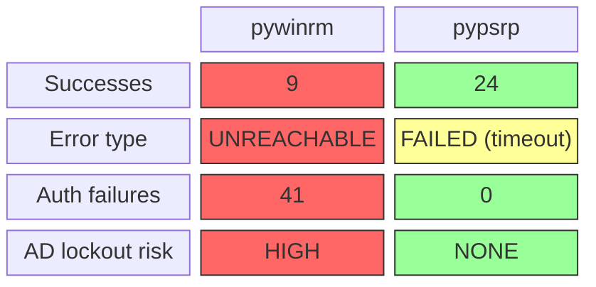
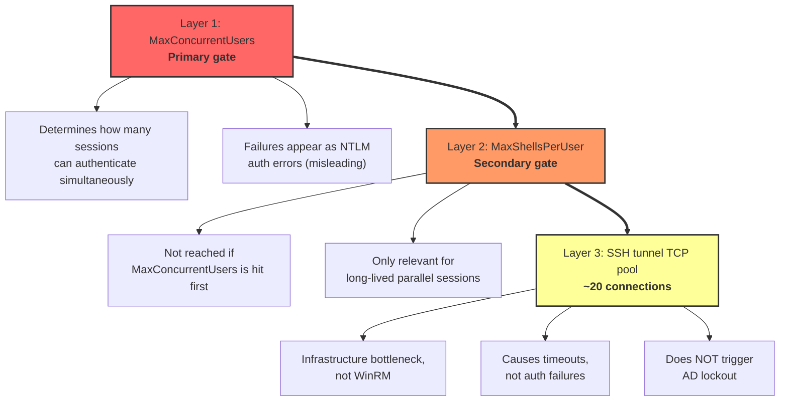

# Benchmark Results

Aggregate findings from pressure testing on win-target (Windows Server 2022).

All tests use 50 inventory entries pointing at a single host via WinRM HTTPS
through an SSH tunnel (`localhost:15986 -> win-target:5986`).

## Test Matrix Summary

| Test | Forks | Plugin | Quotas | Success | Fail | Auth Failures | AD Risk |
|------|-------|--------|--------|---------|------|---------------|---------|
| Safe baseline | 5 | pywinrm | default | 5/5 | 0 | 0 | None |
| Forkbomb | 50 | pywinrm | default | 9/50 | 41 | 41 | **HIGH** |
| Quota elevation | 50 | pywinrm | elevated | 20/50 | 30 | 30 | High |
| Reduced forks | 25 | pywinrm | elevated | 20/25 | 5 | 5 | Moderate |
| PSRP comparison | 50 | pypsrp | elevated | 24/50 | 26 | **0** | **None** |

## Baseline Audit

Pre-existing state on win-target before testing:

| Quota | Found Value | Windows Default |
|-------|------------|-----------------|
| MaxShellsPerUser | 2,147,483,647 | 30 |
| MaxProcessesPerShell | 2,147,483,647 | 25 |
| MaxMemoryPerShellMB | 2,147,483,647 | 1024 |
| MaxConnections | 300 | 25 |
| MaxConcurrentOperationsPerUser | 1,500 | 1,500 |
| IdleTimeout | 7,200,000ms | 7,200,000ms |

All shell quotas had been set to MAX INT by a prior configuration management run,
masking the forkbomb issue entirely. Quotas were reset to Windows defaults before
reproduction testing.

## Forkbomb Reproduction (9/50 pass)

With Windows default quotas (`MaxShellsPerUser=30`, `MaxConcurrentUsers=10`):

- **9 of 50** connections succeeded, matching the `MaxConcurrentUsers=10` limit
- **41 connections** received NTLM auth failure errors
- Error messages say `ntlm:` -- quota exhaustion is disguised as credential rejection
- Each of the 41 failures counts as a failed AD authentication attempt

```
41 failures in ~5 seconds
AD lockout threshold = 5 failures in 15 minutes
= 8x the lockout threshold in a single burst
```

!!! danger "AD Lockout Risk"
    With a shared service account (like `svc-ansible`), a single forkbomb run locks out
    the account across all managed Windows hosts that share it.

## Quota Elevation Fix (20/50 pass)

After raising quotas (`MaxShellsPerUser=100`, `MaxConcurrentUsers=25`):

- **20 of 50** connections succeeded (up from 9)
- Improvement directly correlates with `MaxConcurrentUsers` increase (10 -> 25)
- Remaining 30 failures caused by SSH tunnel TCP connection limits, not WinRM quotas

A follow-up test with `forks=25` (within the `MaxConcurrentUsers=25` limit) still
showed 5 failures, confirming the SSH tunnel as a secondary bottleneck at ~20
concurrent connections.

## PSRP Comparison (24/50 pass, 0 auth failures)

Using `ansible_connection=psrp` with `ansible_psrp_auth=ntlm`:

- **24 of 50** succeeded
- **0 UNREACHABLE** (zero authentication failures)
- **26 FAILED** with `HTTPSConnectionPool: Read timed out` (SSH tunnel bottleneck)



!!! success "Key Finding"
    pypsrp's connection pooling eliminates authentication failures entirely.
    All remaining failures are SSH tunnel TCP timeouts, not auth problems.
    This means pypsrp produces **zero AD lockout risk** even under pressure.

## WinRM Restart Finding

!!! warning "Operational Hazard"
    Restarting the WinRM service from within a WinRM session (`Restart-Service WinRM -Force`)
    can corrupt the service state, leaving it stopped and unrecoverable without a full
    OS reboot.

Key details:

- `Restart-Service WinRM -Force` kills the service process without graceful shutdown
- The service shows as "Stopped" but `Start-Service` fails with "Cannot open WinRM service"
- The HTTPS listener binding is lost
- Only an OS reboot recovers the service

**Mitigation**: WSMan quota changes take effect immediately without a service restart.
The restart handler should be removed from quota configuration roles.

## Bottleneck Hierarchy



## Quota State Comparison

| Setting | Default | Elevated | Effect on 50-fork test |
|---------|---------|----------|------------------------|
| MaxConcurrentUsers | 10 | 25 | 9 -> 20 successes |
| MaxShellsPerUser | 30 | 100 | Not the bottleneck |
| MaxProcessesPerShell | 25 | 50 | Not tested in isolation |
