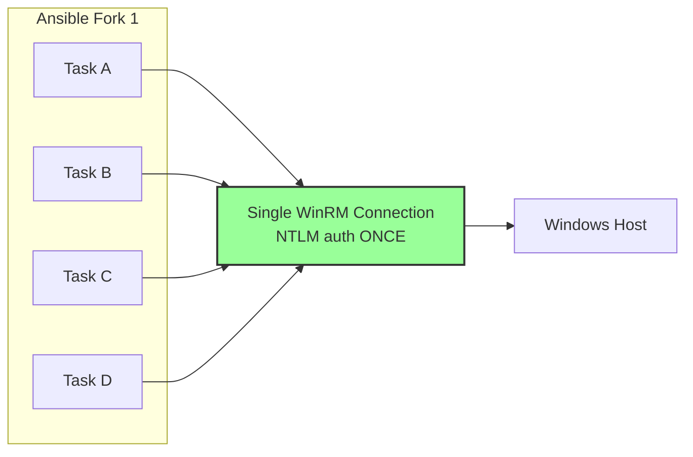

# Ansible + Molecule Parallelism Patterns

## Ansible Forks Model

### Effective Parallelism Formula

```
effective_parallelism = min(forks, serial_batch_size, task_throttle)
```

With `forks=50`, `serial=10`, `throttle=3`:
- Unrestricted tasks run at 10 (serial is bottleneck)
- Throttled tasks run at 3

### Strategies

| Strategy | Behavior | Connection Pattern |
|----------|----------|-------------------|
| `linear` (default) | All hosts complete task before any starts next | N simultaneous connections |
| `free` | Each host progresses independently | Same N connections, different tasks |
| `host_pinned` | Fork stays dedicated to one host | Same N connections, sequential by host |

All strategies respect `forks` as the upper limit. None creates additional connections.

### async + poll

`async: 120` + `poll: 0` fires a task in the background. Does NOT create additional
connections beyond forks — the connection is used briefly to start the background task,
then released. Less practical with WinRM since connections can't be easily multiplexed.

### Mitogen

**Does NOT support WinRM.** Only works with SSH connections.

## pywinrm Connection Lifecycle

Each Ansible task using pywinrm:
1. Opens HTTP connection (or reuses from `requests.Session` pool)
2. Performs NTLM 3-message handshake (Type 1 → Type 2 → Type 3)
3. Creates a new WinRM shell (`wsman:Create`)
4. Executes the command
5. Reads output
6. Closes the shell (`wsman:Delete`)
7. Returns connection to pool

**No shell reuse across tasks.** This is the core of the forkbomb problem.

### Thread Safety (pywinrm#277)

Sharing a `Session`/`Protocol` across threads causes `InvalidCredentialsError` because
NTLM's stateful auth handshake gets corrupted when threads interleave messages.
Each Ansible fork (separate process) gets its own Protocol — safe by isolation.

### NTLM Overhead

3 HTTP round-trips minimum per new connection:
1. Type 1 negotiation message
2. Type 2 challenge from server
3. Type 3 authentication response

Amortized when connection is reused, but pywinrm's shell-per-task model means
re-authentication happens for each new TCP connection.

## pypsrp Connection Model (The Fix)

### Runspace Pool Architecture



- **One TCP connection** per RunspacePool, reused for ALL commands
- Authentication happens **once** at pool creation
- No per-task shell creation/destruction
- Variables and session state persist across commands
- 50-65% faster than pywinrm for repeated operations

### Key PSRP Settings

```yaml
ansible_psrp_reconnection_retries: 3    # default 0
ansible_psrp_reconnection_backoff: 2    # exponential backoff seconds
ansible_psrp_operation_timeout: 20      # seconds
ansible_psrp_read_timeout: 30           # seconds
ansible_psrp_connection_timeout: 30     # seconds
```

## Molecule Parallelism

### Native `--parallel` Flag

Uses Python `multiprocessing` process pool. Each scenario gets a UUID-based
ephemeral directory for isolation. Platform names auto-suffixed.

### pytest-xdist

```bash
MOLECULE_OPTS="--parallel" pytest --numprocesses auto --molecule roles/
```

Each worker gets `PYTEST_XDIST_WORKER` env var for unique naming.

### Critical: Prerun Race Condition

Galaxy collection installation is NOT parallel-safe. Multiple processes installing
the same collection cause `File exists` errors.

**Fix**: Disable prerun, install deps serially first:
```yaml
# .config/molecule/config.yml
prerun: false
```
```bash
# Install deps once, then run parallel
ansible-galaxy collection install -r requirements.yml
MOLECULE_OPTS="--parallel" pytest --numprocesses auto --molecule roles/
```

### Known Issue: Molecule 25.2.0 Regression

Issue #4408: Removed UUID-based ephemeral directory isolation, breaking parallel
execution. Check your molecule version before relying on `--parallel`.

## Maximum Connection Pressure Recipe

### Theoretical Maximum

With default Windows quotas (MaxShellsPerUser=30, MaxConcurrentUsers=10):
- Each fork creates 1 connection
- forks=30 would saturate MaxShellsPerUser
- forks=50 would exceed it → errors

### Inventory Trick (Multiple Entries, Same Host)

```yaml
# Create artificial parallelism against single host
windows_pressure:
  hosts:
    win-[01:50]:
      ansible_host: win-target.example.com
```

This creates 50 "hosts" pointing to one machine, exercising forks=50 simultaneously.

### The Forkbomb Formula

```
parallel_molecule_processes × ansible_forks × tasks_per_role = total_shell_attempts
4 × 5 × 15 = 300 attempts against MaxShellsPerUser=30
```

### Error When Quota Exceeded

HTTP 500 from WinRM: "The maximum number of concurrent operations for this user
has been exceeded". Ansible reports as task FAILED, not UNREACHABLE.

## Connection Plugin Architecture

- One connection object per (host, connection_plugin) tuple per worker process
- Connections reused within a play across tasks for the same host
- NOT reused across plays (new play = fresh connection)
- Each fork = separate process = separate connection (no shared state)
- `meta: reset_connection` forces reconnection with new NTLM handshake

## Monitoring During Benchmarks

```powershell
# Real-time shell count
Get-Process wsmprovhost | Measure-Object

# Performance counters
Get-Counter "\WS-Management\Active Shell Sessions",
  "\WS-Management\Active Operations" -SampleInterval 1

# Event log (quota exhaustion = Event ID 142)
Get-EventLog -LogName System -Source WinRM -Newest 100
```
